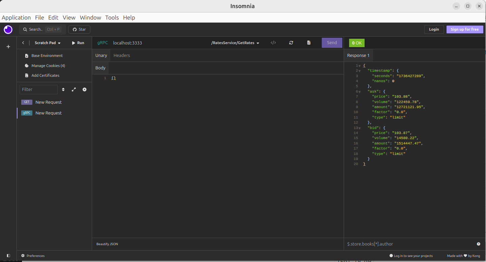

## Запуск приложения

`git clone https://github.com/KirillGreenev/crypto-rate-service`

`cd ./crypto-rate-service`

`docker-compose up -d`

## Переменные среды

Для корректной работы приложения необходимо настроить следующие переменные среды в .env:

| Переменная         | Описание                                               | Значение по умолчанию |
|--------------------|--------------------------------------------------------|-----------------------|
| `DB_PASSWORD`      | Пароль для подключения к базе данных                   | `1234qwerty`         |
| `DB_USER`          | Имя пользователя для подключения к базе данных         | `postgres`           |
| `DB_NAME`          | Имя базы данных                                        | `postgres`           |
| `DB_PORT`          | Порт для подключения к базе данных                     | `5432`               |
| `DB_HOST`          | Хост базы данных (например, IP-адрес или имя хоста)   | `db`                  |
| `GRPC_SERVER_PORT` | Порт для gRPC сервера                                  | `3333`               |
| `LOGGER_LEVEL`     | Уровень логирования (например, INFO, DEBUG)           | `INFO`               |
| `DEBUG_SERVER_PORT`| Порт для отладочного сервера                          | `8080`               |

Переменные среды из файла .env автоматически подставляются в docker-compose.yml

##  Репозиторий содержит Makefile с командами:
- make build - для сборки приложения;
- make test - для запуска unit-тестов;
- make docker-build - для сборки Docker-образа с приложением;
- make run - для запуска приложения;
- make lint - для запуска линтера;

## Пример использования
